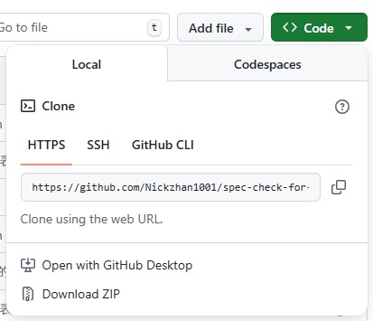
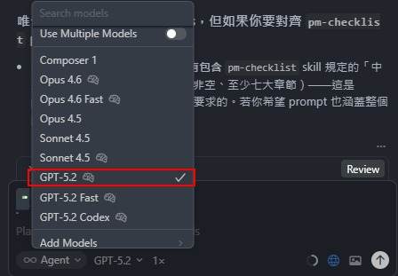

# PM Checklist Generator

透過 **Cursor Agent + pm-checklist skill**，  
自動從 `prd.md` 與 `epics.md` 產生 **PM 客戶用需求檢核清單（Checklist）**。

---

## 🚀 使用方式（How to Use）for PM

### 1️⃣ 下載專案

1. 點擊 GitHub 頁面右上角 **Code**
2. 選擇 **Download ZIP**
3. 解壓縮至本機資料夾



---

### 2️⃣ 使用 Cursor 開啟專案

- 啟動 **Cursor 編輯器**
- 選擇「開啟資料夾」
- 指向剛剛解壓縮後的 **專案根目錄**

---

### 3️⃣ 關閉 Cursor Agent 的自動選擇模型

為避免模型被自動切換，請先關閉 Auto Select。


---

### 4️⃣ 手動選擇模型

請選擇 **GPT-5.x 系列模型**：

- ✅ 建議：`GPT-5.x`
- ❌ 不建議：`Fast` 結尾模型  
  （僅速度較快，但 token 消耗通常更高）



---

### 5️⃣ 放入輸入文件

請在以下路徑放入兩個必要檔案：

```text

analysis_context/
└─ input/
├─ prd.md
└─ epics.md

```

- `prd.md`：產品需求文件（Product Requirement Document）
- `epics.md`：功能 / 模組層級拆解

---

### 6️⃣ 執行 pm-checklist 技能

在 Cursor 的 Agent 輸入以下指令：
```
/pm-checklist 執行 Checklist 完整流程
```

Agent 會自動分析輸入文件並產生對應輸出。

---

### 7️⃣ 輸出檔案說明

執行完成後，會在以下路徑產生檔案：

```text
analysis_context/
└─ output/
├─ pm-client-checklist.md
└─ pm-client-checklist-full.md
```


| 檔案名稱 | 說明 |
|---------|------|
| `pm-client-checklist.md` | 標準版（不含名詞解釋） |
| `pm-client-checklist-full.md` | Full 版（包含名詞解釋，問題數量與語意一致） |

---

### 8️⃣ 檢核（重要）

在產生 **Full 版** 之前，請先確認以下條件：

- `analysis_context/output/pm-client-checklist.md` **已存在**
- 檔案內容 **非空**
- 至少包含 **七大章節標題**  
  （章節編號為「一」到「七」）

若條件未滿足，請先確認：

- `prd.md` 是否內容完整
- `epics.md` 是否正確拆解
- Agent 是否有中途被中斷

---

## 📂 專案結構說明（簡要）

```text
analysis_context/
├─ input/ # 輸入文件（PRD / Epics）
└─ output/ # 產出的 Checklist 檔案
```

---

## 📌 注意事項

- 建議每次執行前確認 `prd.md`、`epics.md` 為最新版本
- 若輸出結果異常，可重新執行一次指令
- Full 版僅比標準版多「名詞解釋」，問題數量與語意完全一致

---

## ❓ 常見問題（FAQ）

**Q：可以只產生標準版嗎？**  
A：可以，標準版一定會先產生，Full 版以標準版為基礎擴充。

**Q：Checklist 的章節數是固定的嗎？**  
A：是，至少包含七大章節，用於確保 PM 檢核完整性。

**Q：可以更換模型嗎？**  
A：不建議，請固定使用 GPT-5.x 以確保輸出穩定性。

---

## 🧭 適用對象

- 產品經理（PM）
- 產品經理助理（PMA）
- 需要快速產出「客戶需求檢核清單」的專案團隊
- 使用 Cursor Agent 進行規格導向工作的團隊

---


